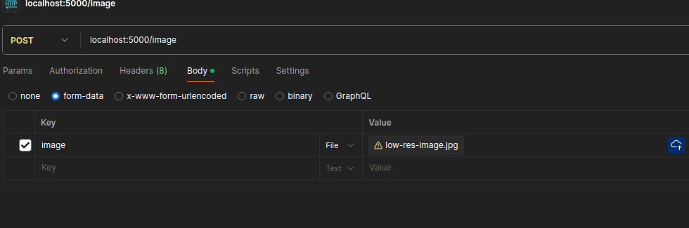

# HostedAPI

> A project to document how to create an API that accepts all sorts of requests of audio, video and images and how to host it on azure.


### How to run:

For development
```bash
flask --app api run
```

#### Images:

Sending images with curl:

```bash
curl -X POST -F "image=@../low-res-image.jpg" localhost:5000/image
```

The same image can be sent via POSTMAN.



Dealing with images in a nutshell:

- The image needs to be converted from bytes to image format.
- This can be done using the BytesIO library
- Need to send a response back to client with the image
- This time we encode it in a base64 format.

### Deploying on azure

For development:

- Ssh into compute instance
- Run `flask --app api run host=0.0.0.0`. 
- On your client (local computer), go to the following URL:
    `https://<vm_name>-<local_service_port>.<azure_region_of_workspace>.instances.azureml.net`
    